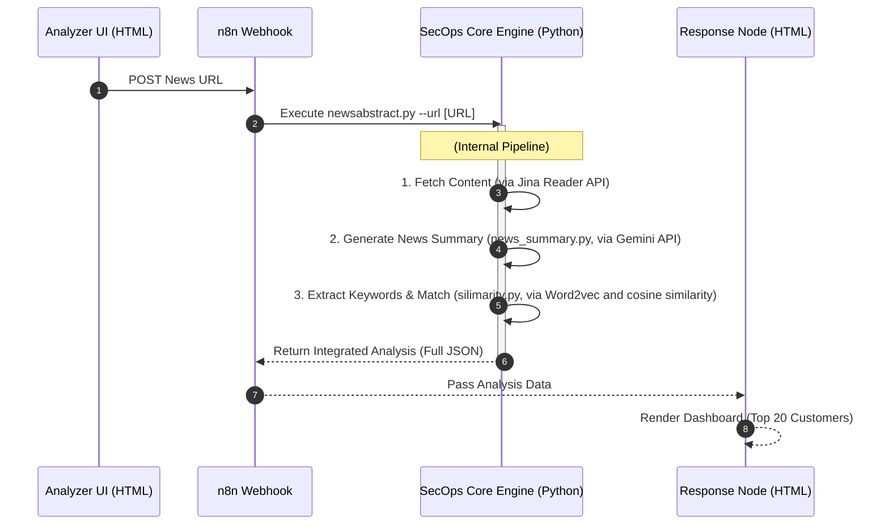
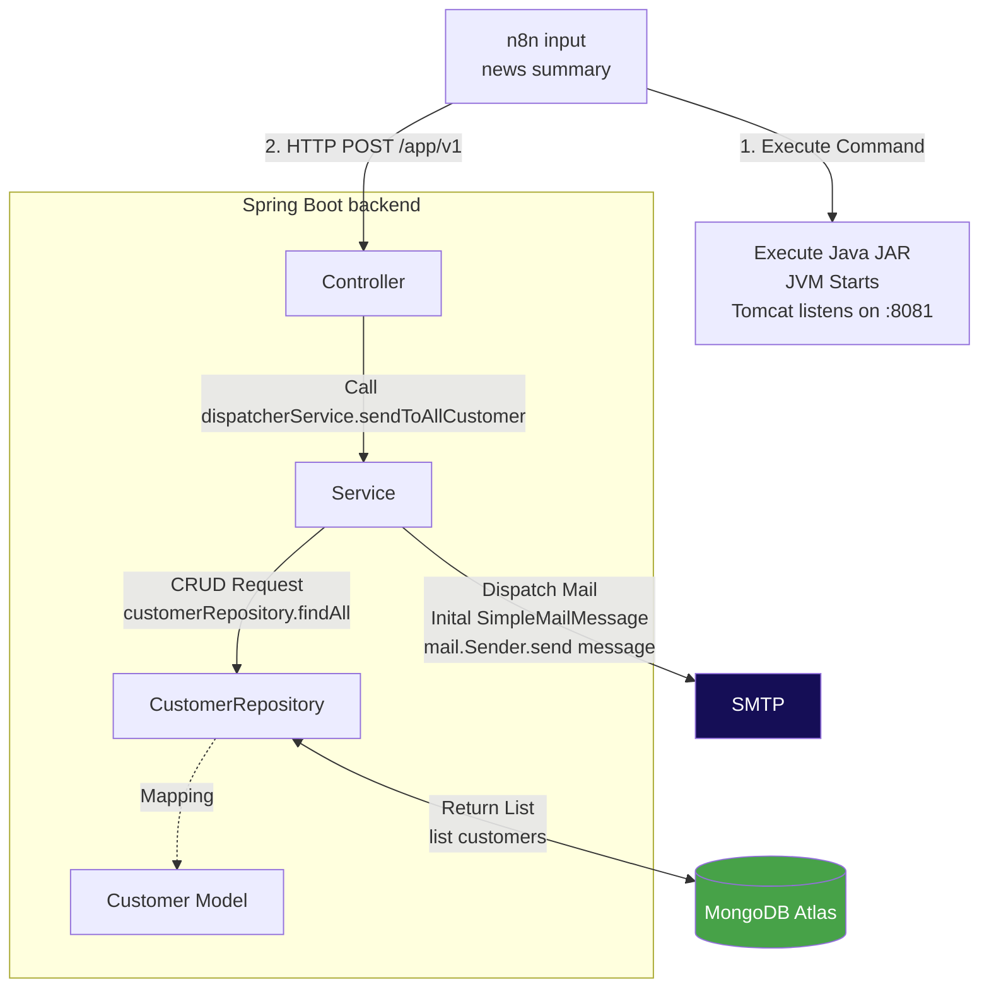

# SecOps News Analysis System

## Overview
In a modern SOC (Security Operations Center), analysts are overwhelmed by daily security news. This project automates the "News-to-Impact" pipeline:

* **Automated Summarization**: Extracts core technical values using LLM.

* **Semantic Correlation**: Uses NLP (Word2Vec) to match news keywords with customer profiles, going beyond simple keyword matching.

* **Prioritized Reporting**: Generates a ranked list of affected customers to reduce Mean Time to Acknowledge .

## System Architecture &　Workflow
The following Sequence Diagram accurately reflects the current n8n implementation, including external command executions and data branching:


## 1. Environment Setup
Ensure that **Python 3.10+** and **Node.js** are installed. From the project root directory, run:

```powershell
# Install all necessary Python libraries
pip install -r requirements.txt
```
## 2. Launch Steps (By Operating System)
Windows (PowerShell)
PowerShell
```
# 1. Execute model initialization (Absolute path required)
cd "/[YOUR_PATH]/NewsAbstract/news-analyzer-py"
python keyvector_model.py
# 2. Set environment variables (Ensure n8n can access APIs)
$env:GEMINI_API_KEY="YOUR_GEMINI_KEY"
$env:JINA_API_KEY="YOUR_JINA_KEY"
$env:NODES_EXCLUDE="[]";
$env:PYTHONIOENCODING="utf-8"
# 3. Start n8n
npx n8n
```
macOS / Linux (Terminal)
Bash
```
# 1. Execute model initialization (Absolute path)
cd "/[YOUR_PATH]/NewsAbstract/news-analyzer-py"
python keyvector_model.py

# 2. Set environment variables
export GEMINI_API_KEY="YOUR_GEMINI_KEY"
export JINA_API_KEY="YOUR_JINA_KEY"
export NODES_EXCLUDE="[]"
export PYTHONIOENCODING="utf-8"

# 3. Start n8n
npx n8n
```
## 3. n8n Workflow Initialization
Access n8n: Open your browser and navigate to http://localhost:5678.<br>
Import Workflow: Drag and drop my_workflow.json into the canvas.<br>
Official Deployment: Click Publish in the top-right corner (ensure the toggle turns green).<br>
## 4. Launch Frontend Tools
Locate Analyzer.html (webhook.html) in the project folder.<br>
Open it directly (Recommended: Save as a browser bookmark).<br>

# Security News Dispatcher (Security News Distribution System)

This is a B2B automated security news distribution system developed based on **Spring Boot**. It is primarily used to fetch client lists from **MongoDB** and supports real-time delivery of the latest security threat notifications to corporate clients via **Email (SMTP)** and **Teams Webhook**.

---

## 🛠️ Prerequisites

After cloning this project, please ensure your development environment meets the following requirements:

* **Java 17** or above
* **Maven** (Project includes `mvnw` wrapper)
* **MongoDB Atlas** Cloud database account
* **SMTP Server** (It is recommended to use [Mailtrap](https://mailtrap.io/) for Sandbox testing during the development phase)

---




### 1. Clone Project and Environment Variables Setup
After cloning the project, go to `src/main/resources/application.properties` to configure your database and mailing environment:

properties
```
server.port=8081
# --- MongoDB Settings ---
# Note: Spring Boot 3.x must use spring.data.mongodb.uri
spring.mongodb.uri=mongodb+srv://<Your_Account>:<Your_Password>@cluster0.xxxx.mongodb.net/newsdb?retryWrites=true&w=majority
# --- Email (SMTP) Settings (Using Mailtrap as an example) ---
spring.mail.host=sandbox.smtp.mailtrap.io
spring.mail.port=2525
spring.mail.username=<Mailtrap Username>
spring.mail.password=<Mailtrap Password>
spring.mail.properties.mail.smtp.auth=true
spring.mail.properties.mail.smtp.starttls.enable=true
```

### 2. Create Test Data (MongoDB)
Please create a collection named webhooks in MongoDB and execute the following via MongoDB Compass _MONGOSH:
```
use newsdb;
db.webhooks.insertOne({
    "name": "Test Client A",
    "email": "your_test_email@gmail.com",
    "webhookUrl": "https://Your_Teams_Webhook_URL"
});
```
or mutually insert document:
```
{
    "name": "Test Client A",
    "email": "your_test_email@gmail.com",
    "webhookUrl": "https://Your_Teams_Webhook_URL"
}
```

### 3.Start Project
Run the following command in the project root directory:
```
./mvnw spring-boot:run
```

### 4.Test
```
curl -X POST http://localhost:8081/api/v1/send
-H "Content-Type: text/plain;charset=UTF-8"
-d "🚨 [Security Alert] Latest zero-day vulnerability detected. Please take precautions!"
```

### Troubleshooting FAQ

Q: The program log is stuck at "preparing send email to..."?<br>
Reason: Usually, message.setTo() or mailsender.send(message) is missing.<br>


Q: It shows "sent successfully," but I didn't receive the email in my inbox?<br>
Solution: The development environment uses Mailtrap; emails are intercepted in ththe Mailtrap web dashboard and will not be delivered to real mailboxes.<br>