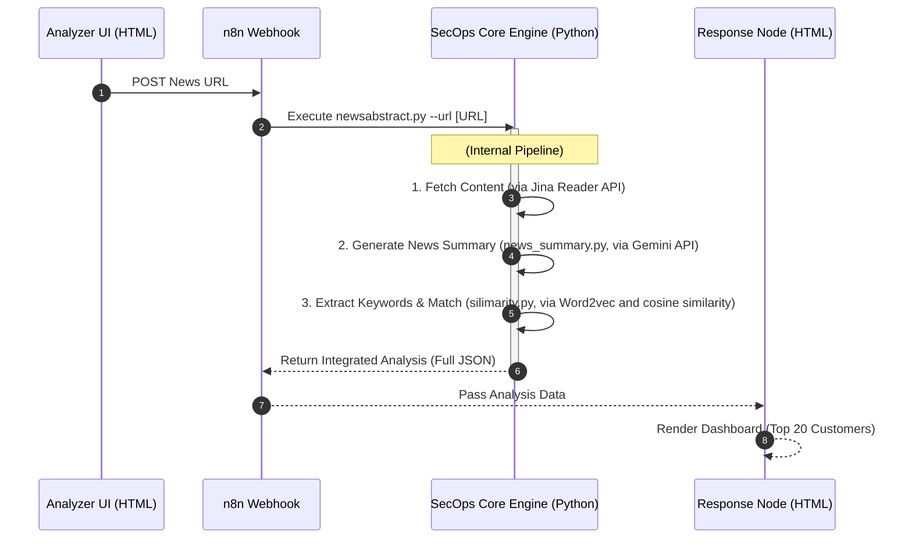

# SecOps News Analysis System

## Overview
In a modern SOC (Security Operations Center), analysts are overwhelmed by daily security news. This project automates the "News-to-Impact" pipeline:

* **Automated Summarization**: Extracts core technical values using LLM.

* **Semantic Correlation**: Uses NLP (Word2Vec) to match news keywords with customer profiles, going beyond simple keyword matching.

* **Prioritized Reporting**: Generates a ranked list of affected customers to reduce Mean Time to Acknowledge (MTTA).

## System Architecture &　Workflow
The following Sequence Diagram accurately reflects the current n8n implementation, including external command executions and data branching:


## 1. Environment Setup
Ensure that **Python 3.10+** and **Node.js** are installed. From the project root directory, run:

```powershell
# Install all necessary Python libraries
pip install -r requirements.txt
```
## 2. Launch Steps (By Operating System)
Windows (PowerShell)
PowerShell
```
# 1. Execute model initialization (Absolute path required)
cd "/[YOUR_PATH]/NewsAbstract"
python keyvector_model.py
# 2. Set environment variables (Ensure n8n can access APIs)
$env:GEMINI_API_KEY="YOUR_GEMINI_KEY"
$env:JINA_API_KEY="YOUR_JINA_KEY"
$env:NODES_EXCLUDE="[]";
$env:PYTHONIOENCODING="utf-8"
# 3. Start n8n
npx n8n
```
macOS / Linux (Terminal)
Bash
```
# 1. Execute model initialization (Absolute path)
cd "/[YOUR_PATH]/NewsAbstract"
python keyvector_model.py

# 2. Set environment variables
export GEMINI_API_KEY="YOUR_GEMINI_KEY"
export JINA_API_KEY="YOUR_JINA_KEY"
export NODES_EXCLUDE="[]"
export PYTHONIOENCODING="utf-8"

# 3. Start n8n
npx n8n
```
## 3. n8n Workflow Initialization
Access n8n: Open your browser and navigate to http://localhost:5678.<br>
Import Workflow: Drag and drop my_workflow.json into the canvas.<br>
Official Deployment: Click Publish in the top-right corner (ensure the toggle turns green).<br>
## 4. Launch Frontend Tools
Locate Analyzer.html (webhook.html) in the project folder.<br>
Open it directly (Recommended: Save as a browser bookmark).<br>